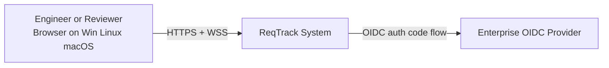
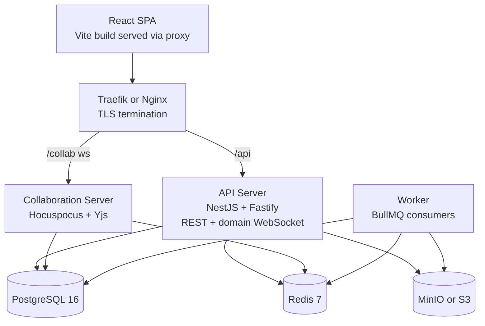
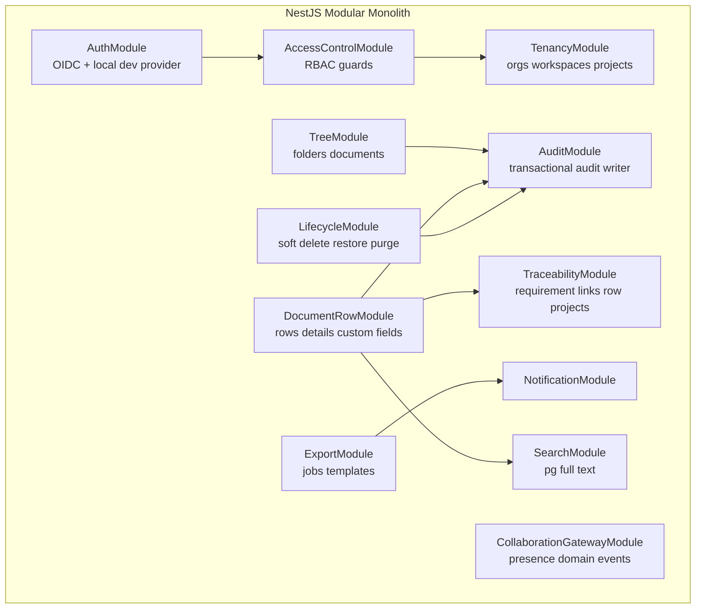
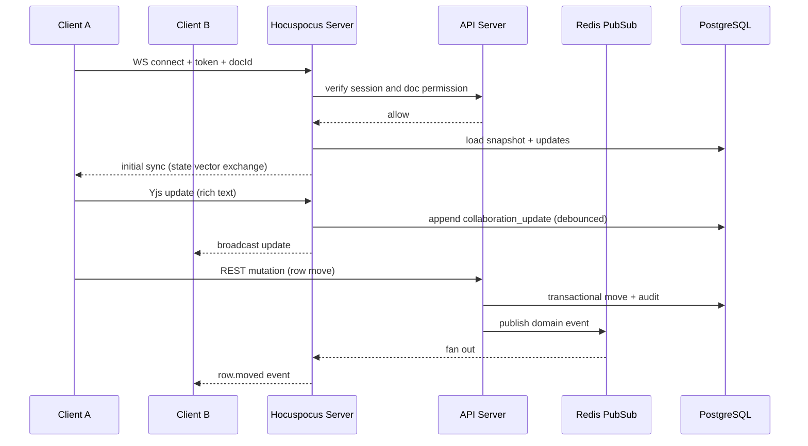
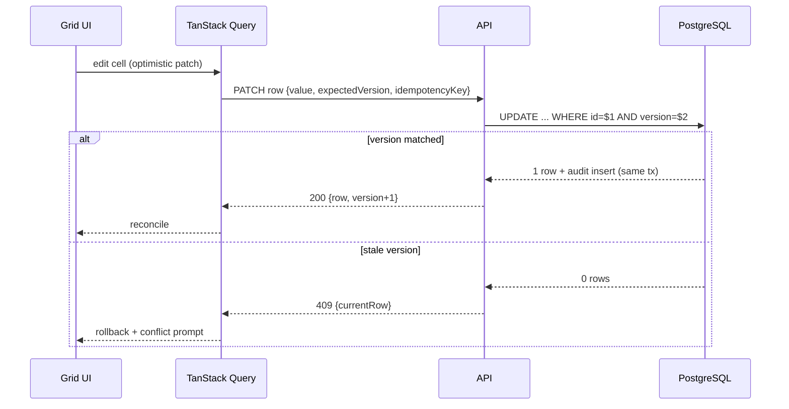
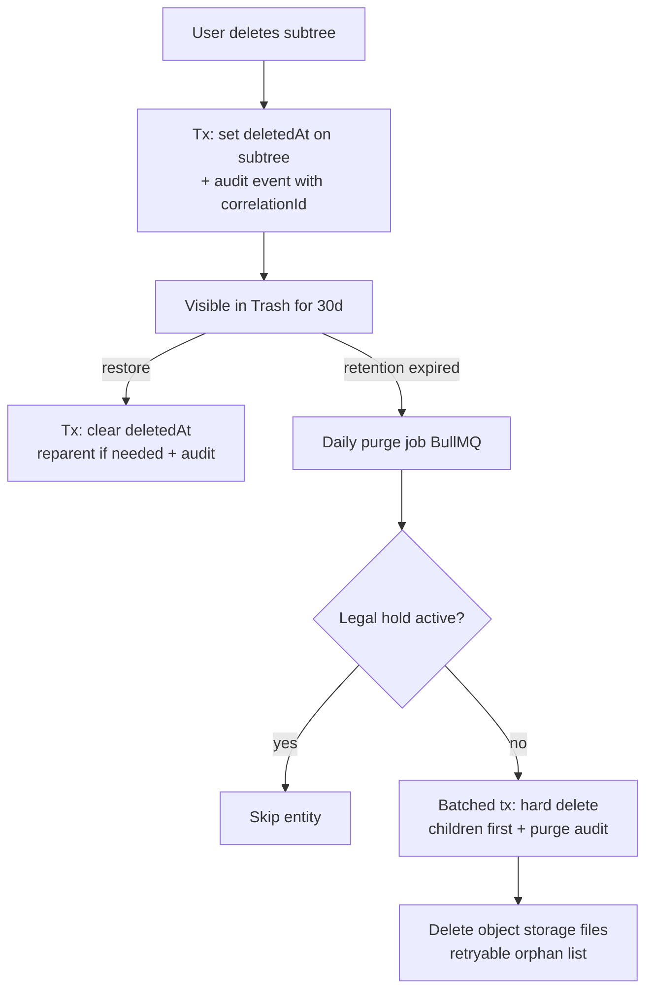
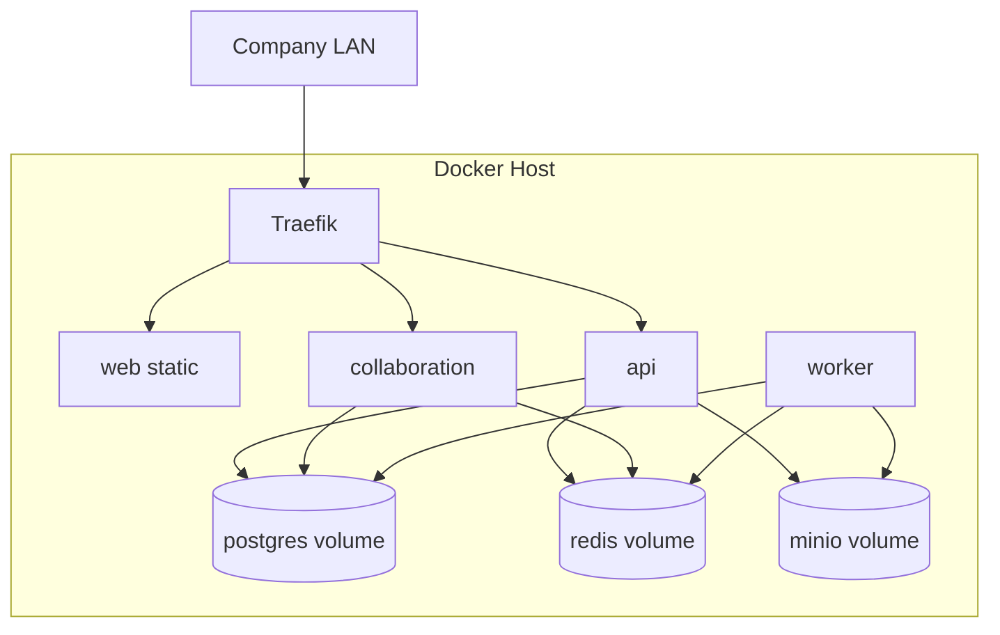

# System Diagrams

## 1. System context

## 2. Container architecture

## 3. Main backend modules

## 4. Realtime collaboration flow

## 5. Document edit sequence (structured field)

## 6. Soft delete and purge flow

## 7. Deployment topology (single node on-prem)

